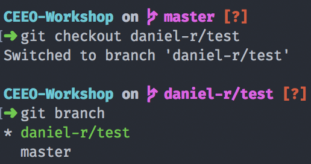
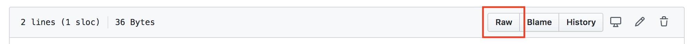
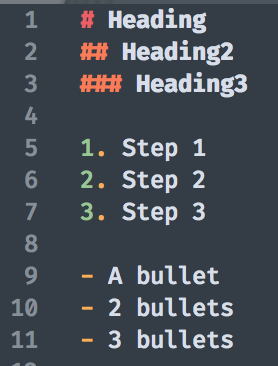

# CEEO WORKSHOP on Monday June 8th

# Goals 
By the end of this workshop, team members will be able to: 
 - Clone an existing repository
 - Maintain local copies of remote repositories 
 - Create and switch to different branches 
 - Create and approve a pull request 
 - Add issues 
 - learn a little markdown 
 - learn .gitignore functionality
 - Obtain workflow options to use when adding/modifying code 

Not only will these tools help you stay up-to-date with the CEEO codebase, they will serve as good documentation practices for your own code.

## Side Note 1: 
Since we'll be working with branches, I like to keep the master branch folder separate from a working branch. If you'd like, before you clone, make another directory on your local machine with `mkdir [firstname]-[lastinitial]`. I'll run `mkdir daniel-r` before I clone. 

## Side Note 2: 
If you haven't linked your github account with git yet, please follow these quick instructions from https://kbroman.org/github_tutorial/pages/first_time.html

# Let's begin! 
Hopefully you received an email (that's linked to your Github account) allowing you to collaborate on here. Contact me immediately if you haven't been sent anything. 

This workshop will mostly be using Terminal/Git Bash and `git`. If you feel comfortable on GitHub Desktop, feel free to follow along on there (you might not get the most out of this workshop, however)

1. Open up your terminal, `cd` to your CEEO workspace (if you don't have one, make one with `mkdir`), and run 
`https://github.com/drybell/CEEO-Workshop.git`. Don't forget to run `cd CEEO-Workshop` to enter the directory

2. Create a branch by using this protocol `git branch [firstname]-[lastinitial]/test` 
For example, I'll run `git branch daniel-r/test` 

Check if you made a branch correctly with `git branch` 

3. Switch to your newly created branch: `git checkout [firstname]-[lastinitial]/test` 
I'll run `git checkout daniel-r/test` to access my branch



4. Create a directory that starts with your first name and ends with last initial. I'll run `mkdir danielr` and change into it. Add a markdown file (I'll do `touch readme.md`)

## Mini Markdown lesson 
Markdown is a simple way to write formatted text by using certain syntax within your favorite text editors like 
VSCode, Sublime, and most other editors (even vim!). This README is written in markdown! If you're confused, you can use my README file as an example by navigating to https://github.com/drybell/CEEO-Workshop/blob/master/README.md and click Raw. 
You can also view syntax.md for more examples.




This is how Sublime visualizes the different syntax of markdown. 

5. Open up the markdown file you created in step 4 in your text editor. 
Please Add: 
- A heading using (#) containing your name 
- Another heading using (##) containing what part of this lesson helped you so far  
- A note to practice using github by making your own repository

## Back to Git 

6. Add another file (using `touch`) called `donotaddme.txt` within your firstname directory. Within it, type in something secret you don't want the world of GitHub to see. Maybe it's an API key that you're using or a password you're storing. 

7. Go back to the base directory (CEEO-Workshop) using `cd ..` and create a `.gitignore` file! 
The command will be `touch .gitignore`, open it up in your text editor, and on the very first line, 
type in `yourdirectoryname/donotaddme.txt`. My `.gitignore` will contain `danielr/donotaddme.txt`

8. After you've modified your files and saved your changes, check what git is tracking by running `git status`. You will see something like: 
``` 
Untracked files:
  (use "git add <file>..." to include in what will be committed)

  		danielr/readme.md
```

9. Time to add your files! Type in `git add your-name-last-initial/readme.md` or, if you're feeling wild, type in `git add *`
The second command adds every file that you've modified/changed since you've last added something with git. This is where the `.gitignore` file comes in. `.gitignore` will literally ignore files that are listed within the file so they won't be accidentally added to GitHub. Since git will ignore `donotaddme.txt`, it will complain about untracked files after you run the add command, but do not worry. 

10. Before you can push, you'll have to commit your changes. Run `git commit -m "added my readme!"`

11. Now it is time to push. Since you're on a branch different than `master`, `git push` won't work. 
You can try, but git will yell at you. The suitable command is `git push -u origin your-branch` 
in order to set your remote destination. Since my branch is called daniel-r/test, I'll be running 
`git push -u origin daniel-r/test`

12. Time to add a pull request. Navigate to CEEO-Workshop (https://github.com/drybell/CEEO-Workshop/) and click on Pull requests. 

13. 


